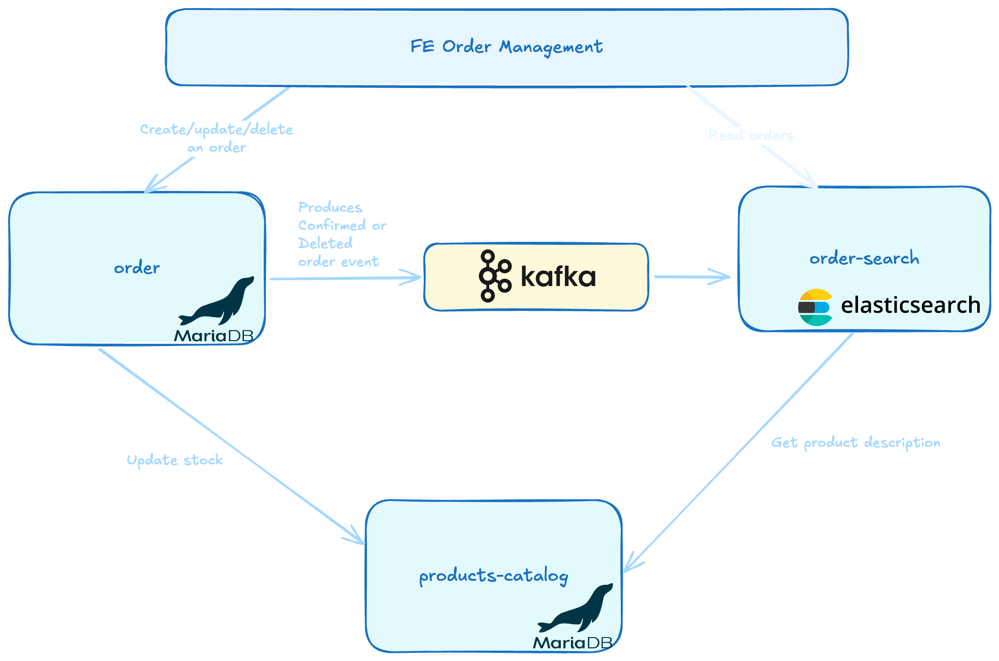

# project-be-order-management

## Description
The project-be-order-management is an exercise to simulate an order management system that allows you to:

- Create an order.
- Update the quantities of a product for a given order, only if the order has not been previously canceled.
- Cancel the order.

Each of these operations results in an update of the quantities in the product catalog.


## Project Overview

The project contains the following modules/microservices:

- **product-catalog**: This module provides REST APIs to retrieve the products listed in the product catalog and update the stock of each product. The update service manages concurrency between threads accessing the same records.

- **order**: This module provides REST APIs to create, update, or logically delete orders.

- **order-search**: This module provides a REST API for querying various orders, filtering by product name/description, order status, and order creation date.

- **client**: This module contains a single interface used to leverage OpenFeign.


## Architechture


## Set up
1. Run docker compose
   ```bash
   docker compose up
   
2. Connect to the MariaDb database

   ```
   server: localhost:3306
   user: root
   password: rootpassword
   
3. Run the following query in catalog db
   ```roomsql
   INSERT INTO catalog.products (stock, name, description, category) VALUES
   (100, 'The Great Gatsby', 'A novel by F. Scott Fitzgerald', 'BOOKS'),
   (50, 'Running Shoes', 'Comfortable running shoes for all terrains', 'FASHION'),
   (30, 'Gaming Laptop', 'High-performance laptop for gaming and work', 'COMPUTERS'),
   (20, 'Smartphone', 'Latest model smartphone with advanced features', 'ELECTRONICS'),
   (15, 'Chess Set', 'A complete chess set for enthusiasts', 'GAMES'),
   (200, 'Wireless Headphones', 'Noise-cancelling wireless headphones', 'ELECTRONICS'),
   (75, 'Python Programming Book', 'Learn Python with practical examples', 'BOOKS'),
   (10, 'Fashion Backpack', 'Stylish and spacious backpack for daily use', 'FASHION'),
   (5, '4K Monitor', 'Ultra HD monitor for graphic design and gaming', 'COMPUTERS'),
   (25, 'Action Video Game', 'Exciting action game for console', 'GAMES');
   (120, 'Wireless Mouse', 'Ergonomic wireless mouse with long battery life', 'COMPUTERS'),
   (60, 'Leather Jacket', 'Stylish leather jacket for both men and women', 'FASHION'),
   (40, 'Gardening Tools Set', 'Complete set for gardening enthusiasts', 'ELECTRONICS'),
   (150, 'Fantasy Novel', 'An epic fantasy novel full of adventure', 'BOOKS'),
   (30, 'Board Game', 'Fun board game for family nights', 'GAMES'),
   (90, 'Bluetooth Speaker', 'Portable speaker with high-quality sound', 'ELECTRONICS'),
   (80, 'Laptop Stand', 'Adjustable stand for better ergonomics while working', 'COMPUTERS'),
   (55, 'Casual T-Shirt', 'Comfortable cotton t-shirt in various colors', 'FASHION'),
   (10, 'Video Game Console', 'Latest generation gaming console', 'GAMES'),
   (200, 'Cooking Essentials', 'Set of essential cooking tools and utensils', 'ELECTRONICS');

4. Run the 3 microservices
   ```
   spring-boot:run

## TODOs
1. Validation on request parameters/request body (es. param not null)
2. Use properties for topic name and group-id in order and order-search modules
3. Add cache when order-search asks for product description to product-catalog
4. Use JsonDelerializer instead of object mapper when deserializing the event in product-catalog
5. Add common interfaces (that don't change frequently, like BaseCommand) in a library
6. Use TestContainer to test Controllers in order and order-search modules (used only in product-catalog at the moment)


## Issues to solve
1. Sometimes no partition is assigned to the group id ORDERCREATIONUPDATE_ENGINE_GROUP_ID in order-search